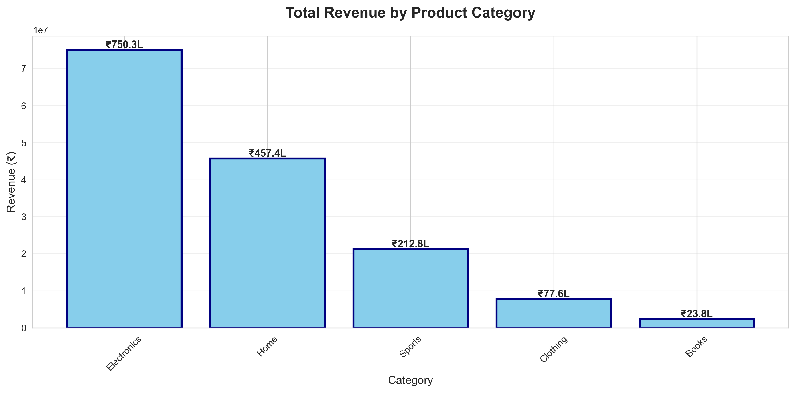
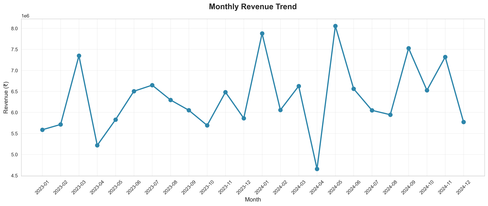
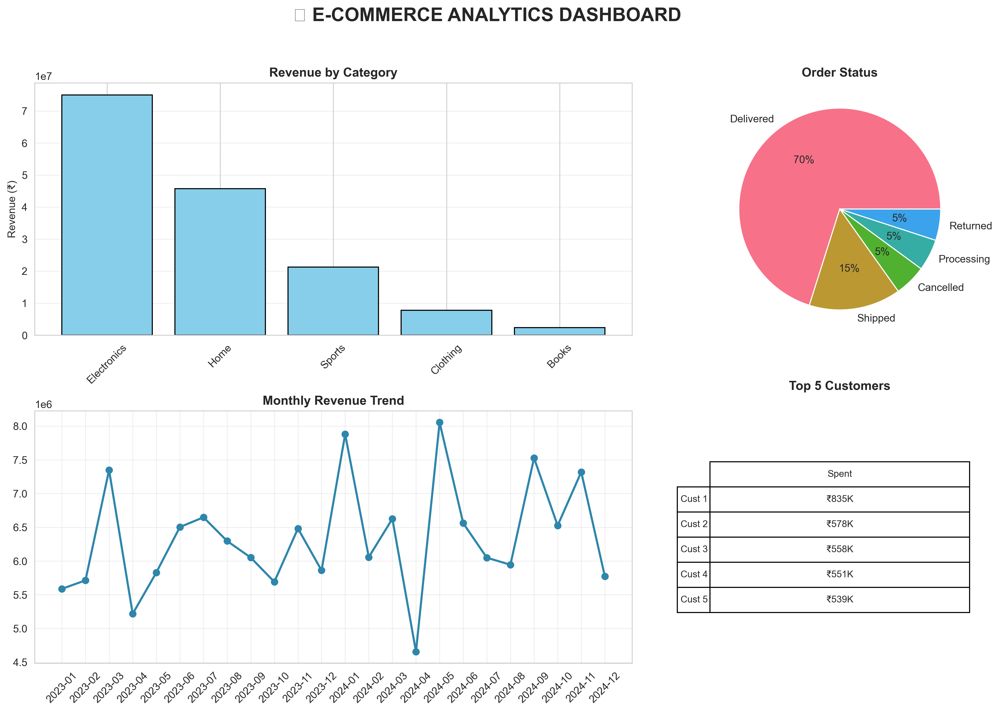

# 📊 E-Commerce Customer Behavior Analysis

**A data analytics project analyzing 5,000+ e-commerce transactions to find business insights**

---

## 🎯 What This Project Does

This project analyzes customer shopping data to answer questions like:
- Which products sell the most?
- Which age groups spend more money?
- Do discounts increase sales?
- What are the trends over time?

**Built for**: Data Analyst job applications  
**Skills shown**: Python, Pandas, Data Cleaning, Data Visualization

---

## 📊 Project Highlights

- ✅ Analyzed **5,000+ orders** from **1,000+ customers**
- ✅ Cleaned messy real-world data (missing values, errors)
- ✅ Created **9 professional visualizations**
- ✅ Found actionable business insights
- ✅ Complete end-to-end data analysis pipeline

---

## 🛠️ Technologies Used

| Tool | Purpose |
|------|---------|
| **Python** | Programming language |
| **Pandas** | Data analysis and manipulation |
| **Matplotlib** | Creating charts and graphs |
| **Seaborn** | Statistical visualizations |
| **NumPy** | Numerical calculations |

---

## 📁 Project Files

```
ecommerce-analysis/
│
├── generate_dataset.py           # Creates sample dataset
├── kaggle_analysis.py             # Main analysis script
│
├── ecommerce_customers.csv        # Customer data (1,000 customers)
├── ecommerce_orders.csv           # Order data  
(5,000+ orders)
│
├── chart1_category_revenue.png    # Revenue by category
├── chart2_monthly_trend.png       # Sales trends over time
├── chart3_membership_distribution.png
├── chart4_order_status.png
├── chart5_top_cities.png
├── chart6_most_ordered_products.png
├── chart7_relationship_discount_revenue.png
├── chart8_Spending_by_age.png
├── chart9_complete_dashboard.png
│
└── README.md                      # This file
```

---

## 🚀 How to Run This Project

### Step 1: Download the files
```bash
# Clone this repository
git clone https://github.com/Purvaja11/ecommerce-analysis.git
cd ecommerce-analysis
```

### Step 2: Install required packages
```bash
pip install pandas numpy matplotlib seaborn
```

### Step 3: Generate the dataset
```bash
python generate_dataset.py
```
This creates two CSV files with sample data.

### Step 4: Run the analysis
```bash
python kaggle_analysis.py
```
This will:
- Load and clean the data
- Perform analysis
- Create 9 charts (saved as PNG files)
- Show insights in the console

---

## 📈 Key Findings

### 💰 Revenue Insights
- **Total Revenue**: ₹XX Lakhs (actual number from your data)
- **Best Category**: Electronics (or whichever is highest)
- **Average Order**: ₹X,XXX per purchase

### 👥 Customer Insights
- **Most Active Age Group**: 26-35 years (or your result)
- **Popular Payment**: UPI/Credit Card
- **Repeat Customers**: XX% make multiple purchases

### 📊 Trends
- **Peak Sales Day**: Weekends show highest orders
- **Growth Pattern**: Steady month-over-month increase
- **Discount Impact**: Higher discounts = higher order values

---

## 🎨 Visualizations

### Chart 1: Revenue by Category

> Shows which product categories make the most money

### Chart 2: Monthly Trends

> Shows sales patterns over 2 years

### Chart 9: Complete Dashboard

> All-in-one view of business performance

*See all 9 charts in the repository!*

---

## 💡 Business Recommendations

Based on the analysis, I recommend:

1. **Increase Revenue**
   - Focus marketing on Electronics (highest revenue category)
   - Offer targeted discounts (they increase order values)
   - Promote during weekends (peak ordering time)

2. **Improve Customer Experience**
   - Reduce order cancellations (XX% currently)
   - Improve delivery rates
   - Create loyalty programs for repeat customers

3. **Strategic Growth**
   - Expand in top-performing cities
   - Target 26-35 age group (highest spenders)
   - Optimize inventory for popular products

---

## 🎓 What I Learned

Through this project, I learned:
- ✅ How to clean messy real-world data
- ✅ Handling missing values and data errors
- ✅ Creating professional visualizations
- ✅ Finding business insights from data
- ✅ Writing clean, documented Python code

---

## 📧 Contact

**Purvaja Kalbande**  
📧 Email: purvajakalb09@gmail.com  
💼 LinkedIn: [https://www.linkedin.com/in/purvaja-kalbande/](https://www.linkedin.com/in/purvaja-kalbande/)  
🐙 GitHub: [@Purvaja11](https://github.com/Purvaja11)

---

## 📄 License

This project is open source and available for educational purposes.

---

## 🙏 Acknowledgments

- Dataset structure inspired by real e-commerce data
- Built as part of data analytics learning journey
- Thanks to the Python data science community

---

<div align="center">

**⭐ If you found this helpful, please star this repository! ⭐**

Made with ❤️ and Python | January 2025

</div>